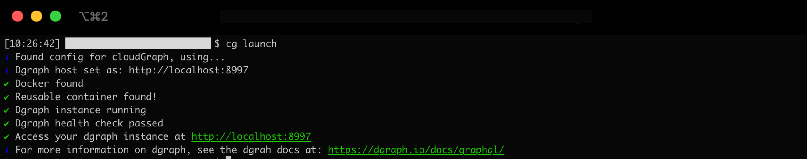
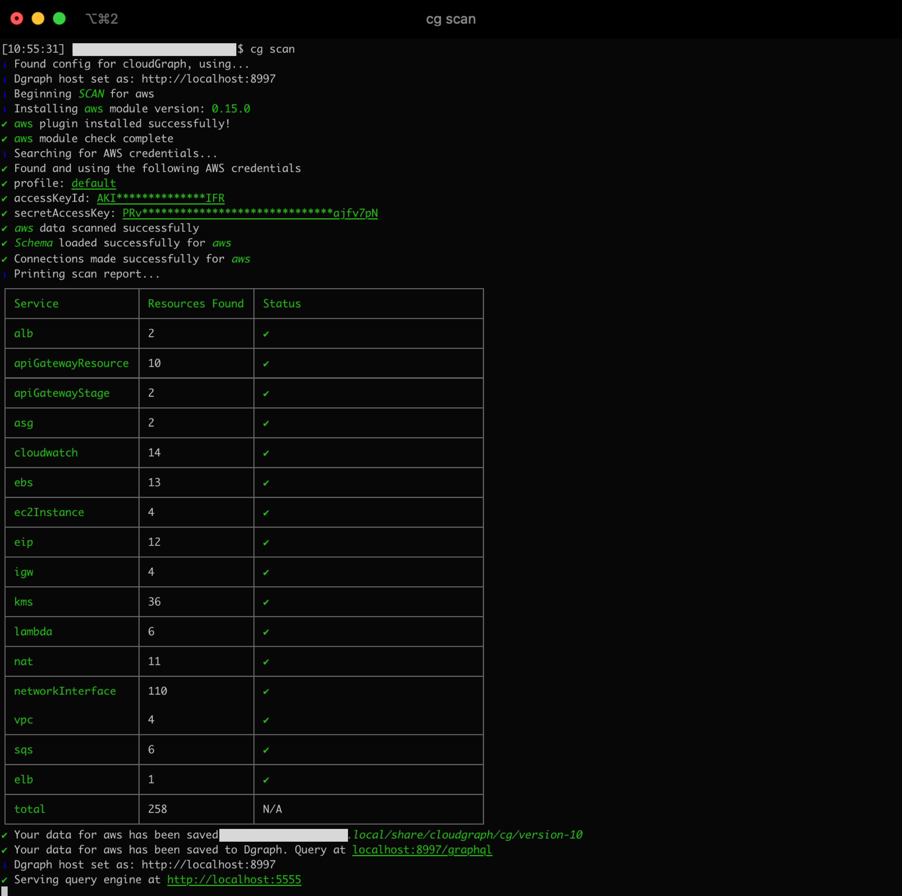
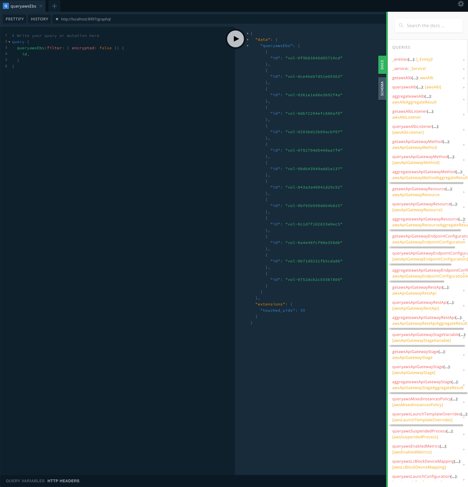
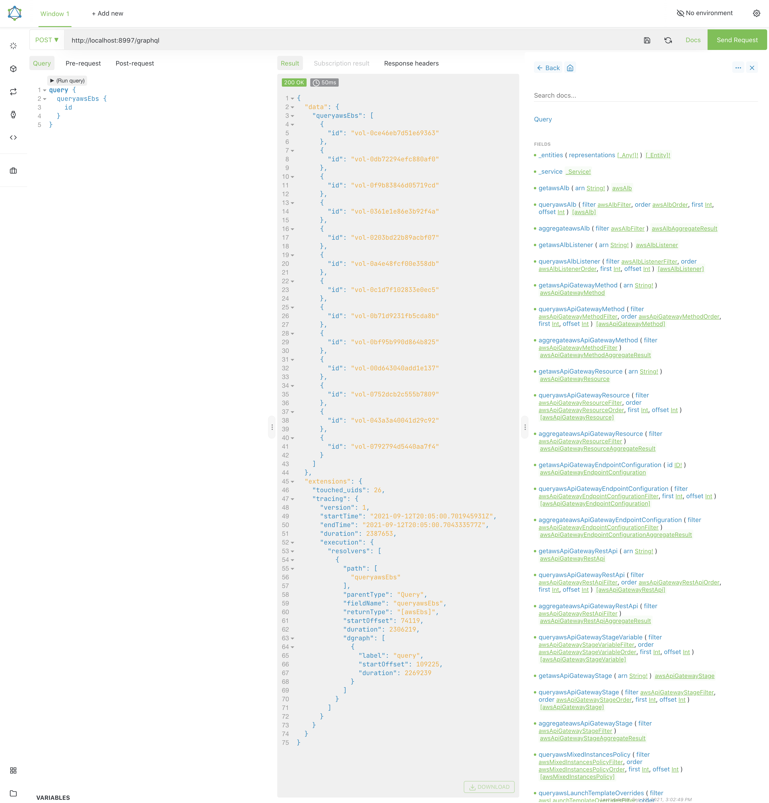
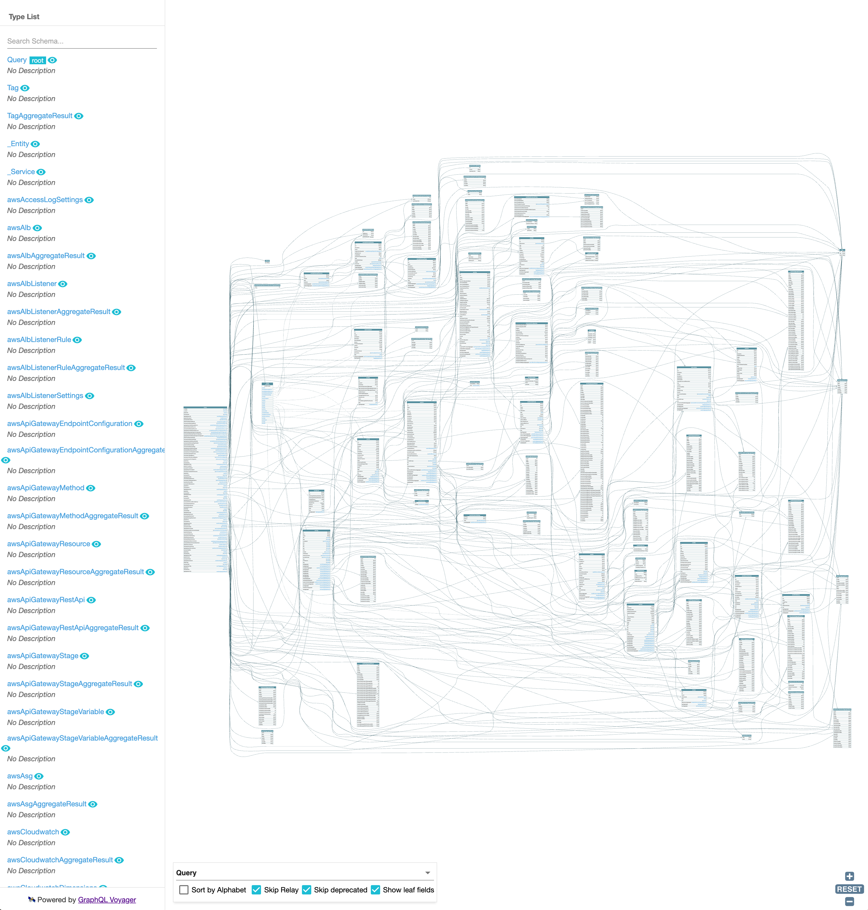

<br />

[]('logo.png')

<br />

An instant **GraphQL** API to query your cloud infrastructure and configuration so that you can solve a host of complex **security**, **compliance**, and **governance** challenges 10x faster. Built and maintained with love by the team at ❤️ [AutoCloud](https://www.autocloud.dev/)❤️

<br />

[](https://oclif.io)
[](https://npmjs.org/package/@cloudgraph/cli)
[](https://npmjs.org/package/@cloudgraph/cli)
[](https://github.com/cloudgraphdev/cli/blob/master/package.json)

<!-- toc -->

- [Why CloudGraph](#why-cloudgraph)
- [How It Works](#how-it-works)
- [Authentication](#authentication)
- [Install](#install)
- [Quick Start](#quick-start)
- [Example Queries](#example-queries)
- [Query Tools](#query-tools)
- [Community](#community)
- [Contribution Guidelines](#contribution-guidelines)
- [Deployment Options](#deployment-options)
- [Commands](#commands)

  <!-- tocstop -->

  <br />

# Why CloudGraph

Whether you're a cloud architect with 15 years of experience or someone who is just getting started on their cloud journey, there is no denying that understanding the exact current state of your (AWS, Azure, GCP...) environments is challenging, time-consuming work. Even answering basic questions like, "What is running in X region?", "Is X secure and compliant?", or "How much is this cluster going cost me in July?" require both time and expertise or expensive 3rd party software.

<br />

**Not anymore.**

<br />

CloudGraph gives anyone working with the cloud superpowers and makes it 🌩️ lightning-fast 🌩️ answer questions like, "What KMS keys do I have in us-east-1?", "Which VMs have unencrypted storage disks?", and "How much does this EC2 instance actually cost to run per month?". Ask any question about your cloud, and get back answers instantly in a single place with a single standardized API, for all of your cloud providers.

# How It Works

Note that CloudGraph requires **READ ONLY** permissions to run and as such can **never** make any changes to your actual cloud infrastructure.

<br />

Under the hood, CloudGraph reaches out to your cloud provider(s), sucks up all of the configuration data, processes it, and stores a copy of this data for you in [Dgraph](https://dgraph.io/). It then exposes a endpoint at `http://localhost:5555` via a tiny node server that allows you to write GraphQL Queries against your stored data. These queries not only allow you do to anything that you would do with say, the AWS SDK/CLI, but they also allow you to run much more powerful queries as well.

<br />

Have some sort of supplemental data that you would like to add for billing, compliance, security, governance...etc? No problem, CloudGraph supports GraphQL Mutations as well so you can update your EC2 Instances with whatever would make your life easier to know.

<br />

# Authentication

CloudGraph currently supports AWS with Azure/GCP (and several others) coming soon. For more information on generating the necessary permission for each cloud provider please view our current provider repos:

<br />

#### [AWS Provider Repo](https://github.com/cloudgraphdev/cloudgraph-provider-aws)

AWS TLDR; For AWS need you an IAM User with the AWS Managed "ReadOnlyAccess" policy attached. CloudGraph will check to see what AWS user you are using in your current terminal session and use those credentions.

<br />

# Install

Note that installation via homebrew and other platforms is coming soon

<!-- install -->

```bash
npm install -g @cloudgraph/cli
```

<!-- installstop -->

<br />

# Quick Start

You can get up and running with three simple commands:

<br />

<!-- quickstart -->

```bash
cg init
```

1. This initializes CloudGraph's configuration. This command will ask you a series of questions about what providers you are using and how you would like CloudGraph configured.

[]('init.png')

<br/>

---

<br/>

```bash
cg launch
```

<br/>

2. This command launches an instance of [Dgraph](https://dgraph.io/), the graphdb CloudGraph uses to store data under the hood. Note that there are 2 ways to launch an instance. **BOTH** of these require [Docker](https://www.docker.com/) to be installed and running. The preferred solution is to use our `cg launch` convience command.

[]('launch.png')

Note that if you do not want to use this command, for example if you want to launch the Dgraph container in interactive mode, you can use the docker command below.

```bash
  docker run -it -p 8995:5080 -p 8996:6080 -p 8997:8080 -p 8998:9080 -p 8999:8000 -v ~/dgraph:/dgraph --name dgraph dgraph/standalone:v21.03.0
```

---

<br/>

```bash
cg scan
```

<br/>

3. Scan for infrastructure updates for all configured providers. This command will reach out and read all of the metadata on your cloud assets. Note that it is **completely normal** to see warnings and errors while the `cg scan` command runs, these are usually caused by permissions issues. That said if you find a bug please open an issue on GitHub or let us know in our slack channel.

[]('scan.png')

That's it, you are all set to start querying! The query tool you selected during the `cg init` command will then be opened in your preferred browser to run queries, mutations and visualizations on all of your cloud infrastructure!

<br/>

Note that you may also use **any** GraphQL query tool you would like by connecting it to http://localhost:8997/graphql.

<!-- quickstartstop -->

<br />

<!-- examplesqueries -->

# Example Queries

To use CloudGraph, you will need to be familiar with GraphQL. This section contains a hanfdull of example queries to get you up and running but is by no means exaustive but if you can dream it up, you can query it! Note that you can find additional example queries in the [examples](examples/) directory. Feel free to make a PR with other examples you would like to see included, checkout the [Contribution Guidelines](#contribution-guidelines) section for more information.

<br />

## AWS Examples:

For the purposes of these example we will just request the ID and ARNs to keep things brief, but you can query whatever attributes you want.

<br />

Get the ID and ARN of a single EC2 instance:

```graphql
query {
  getawsEc2(
    arn: "arn:aws:ec2:us-east-1:123445678997:instance/i-12345567889012234"
  ) {
    id
    arn
  }
}
```

<br />
Get the ID and ARN of each EC2 in your entire AWS account:

```graphql
query {
  queryawsEc2 {
    id
    arn
  }
}
```

<br />
Get the ID and ARN of each EC2 in "us-east-1" using a regex to search the ARN:

```graphql
query {
  queryawsEc2(filter: { arn: { regexp: "/.*us-east-1.*/" } }) {
    id
    arn
  }
}
```

<br />
Do the same thing but checking to see that the region is equal to "us-east-1" instead of using a regex:

```graphql
query {
  queryawsEc2(filter: { region: { eq: "us-east-1" } }) {
    id
    arn
  }
}
```

<br />
Do the same thing but checking to see that the region contains "us-east-1" in the name instead of using eq:

```graphql
query {
  queryawsEc2(filter: { region: { in: "us-east-1" } }) {
    id
    arn
  }
}
```

<br />
Get the ID and ARN of each M5 series EC2 instance in "us-east-1"

```graphql
query {
  queryawsEc2(
    filter: { region: { eq: "us-east-1" }, instanceType: { regexp: "/^m5a*/" } }
  ) {
    id
    arn
  }
}
```

<br />
Do the same thing but skip the first found result (i.e. `offset: 1`) and then only return the first two results after that (i.e. `first: 2`) and order those results by AZ in ascending order (`order: { asc: availabilityZone }`) so that instance(s) in "us-east-1a" are returned at the top of the list.

```graphql
query {
  queryawsEc2(
    filter: { region: { eq: "us-east-1" }, instanceType: { regexp: "/^m5a*/" } }
    order: { asc: availabilityZone }
    first: 2
    offset: 1
  ) {
    id
    arn
  }
}
```

<br />
Do the same thing but also include the EBS volume that is the boot disk for each EC2 instance

```graphql
query {
  queryawsEc2(
    filter: { region: { eq: "us-east-1" }, instanceType: { regexp: "/^m5a*/" } }
    order: { asc: availabilityZone }
    first: 2
    offset: 1
  ) {
    id
    arn
    ebs(filter: { isBootDisk: true }, first: 1) {
      id
      arn
      isBootDisk
    }
  }
}
```

<br />
Do the same thing, but also include the SGs and ALBs for each EC2. For the ALBs, get the EC2s that they are connected to along with the ID and ARN of each found EC2 instance (i.e. a circular query).

```graphql
query {
  queryawsEc2(
    filter: { region: { eq: "us-east-1" }, instanceType: { regexp: "/^m5a*/" } }
    order: { asc: availabilityZone }
    first: 2
    offset: 1
  ) {
    id
    arn
    ebs(filter: { isBootDisk: true }, first: 1) {
      id
      arn
      isBootDisk
    }
    securityGroups {
      id
      arn
    }
    alb {
      id
      arn
      ec2Instance {
        id
        arn
      }
    }
  }
}
```

<br />
Get each VPC, the ALB and Lambdas in that VPC, and then a bunch of nested sub data as well... you get the idea.

```graphql
query {
  queryawsVpc {
    id
    arn
    alb {
      id
      arn
      ec2Instance {
        id
        arn
        ebs(filter: { isBootDisk: true }) {
          id
          arn
        }
      }
    }
    lambda {
      id
      arn
      kms {
        id
        arn
      }
    }
  }
}
```

<br />

## AWS real world use cases:

<br />

Find all the unencrypted EBS Volumes.

```graphql
query {
  queryawsEbs(filter: { encrypted: false }) {
    id
    arn
    availabilityZone
    encrypted
  }
}
```

Find all the KMS keys in "us-east-1"

```graphql
query {
  queryawsKms(filter: { arn: { regexp: "/.*us-east-1.*/" } }) {
    id
    arn
    description
    enableKeyRotation
    tags {
      key
      value
    }
  }
}
```

Find all the burstable instances

```graphql
query {
  queryawsEc2(filter: { instanceType: { regexp: "/^t.*/" } }) {
    id
    arn
    availabilityZone
    instanceType
  }
}
```

Find the default VPCs

```graphql
query {
  queryawsVpc(filter: { defaultVpc: true }) {
    id
    arn
    defaultVpc
    state
  }
}
```

Find the public ALBs

```graphql
query {
  queryawsAlb(filter: { scheme: { eq: "internet-facing" } }) {
    id
    arn
    dnsName
    createdAt
    tags {
      key
      value
    }
  }
}
```

Find all of the EC2s, Lambdas, and VPCs that have a Tag value of "Production".

```graphql
query {
  queryawsTag(filter: { value: { eq: "Production" } }) {
    key
    value
    ec2Instance {
      id
      arn
    }
    lambda {
      id
      arn
    }
    vpc {
      id
      arn
    }
  }
}
```

Do the same thing but look for both a key and a value

```graphql
query {
  queryawsTag(
    filter: { value: { eq: "Production" }, key: { eq: "Environment" } }
  ) {
    key
    value
    ec2Instance {
      id
      arn
    }
    lambda {
      id
      arn
    }
    vpc {
      id
      arn
    }
  }
}
```

Do the same thing using getawsTag instead of `queryawsTag`. Note that when searching for tags using `getawsTag` your must spesify **both** the `key` and `value` as the `id` like is done below with `"Environment:Production"`.

```graphql
query {
  getawsTag(id: "Environment:Production") {
    key
    value
    ec2Instance {
      id
      arn
    }
    lambda {
      id
      arn
    }
    vpc {
      id
      arn
    }
  }
}
```

<br />

### Limitations

Today, the biggest limitation with CloudGraph and our query abilities is we don't support nested filtering based on child attributes. So for example, as cool as it would be to do the following, it's just not possible yet:

```graphql
query {
  queryawsEc2(filter: { ebs: { isBootDisk: true } }) {
    id
    arn
    ebs {
      id
      arn
    }
  }
}
```

This is actually not a limitation of CloudGraph, but rather an feature that still needs to be implemented with Dgraph. [You can view and comment on the discussion thread here](https://discuss.dgraph.io/t/proposal-nested-object-filters-for-graphql-rewritten-as-var-blocks-in-dql/12252/2)

<!-- examplesqueriesstop -->

<br />

# Query Tools

<!-- querytools -->

CloudGraph comes shipped with 2 awesome query tools and a GraphQL schema explorer. Remember, you can use **ANY** GraphQL query tool if you would prefer another option, just connect it to your exposed `/graphql` endpoint!

<br />

## [GraphQL Playground](https://github.com/graphql/graphql-playground)

GraphQL playground has a fluid and engaging UX that is great for querying a GraphQL schema quickly and simply. It has built in automatically generated documentation and autocompletion while you type. To access playground, either select it as your preferred query tool in the `init` command OR visit `/playground` in the server CG spins up.

[]('gqlPlayground.png')

<br />

## [Altair](https://github.com/altair-graphql/altair)

Altair is another great GraphQL query tool that packs a ton of [features](https://github.com/altair-graphql/altair#features) for power users. Do things like autocomplete queries, dynamically add fragments, and export/import collections of queries. To access Altair, either select it as your preferred query tool in the `init` command OR visit `/altair` in the server CG spins up.

[]('gqlAltair.png')

<br />

## [Voyager](https://github.com/APIs-guru/graphql-voyager)

GraphQL Voyager is an awesome way to explore the schema(s) for your CG providers. It gives you a great bidirectional chart containing all your types and queries. You can click entities or arrows to discover connections, search for something specific, and get a deeper understanding of your schema. To access voyager, visit `/voyager` in the server CG spins up.

[]('voyager.png')

<!-- querytoolsstop -->

<br />

# Community

<br />

Comments, questions, or feedback? Please [Join Our Slack Channel](https://join.slack.com/t/cloudgraph-workspace/shared_invite/zt-vb8whl6u-3YH0F4mHXNyC6SOqZJvClQ) we would love to hear from you.

<br />

# Contribution Guidelines

If you're interested in contributing to CloudGraph please check out our [Contribution Guidelines](CONTRIBUTING.MD).

<br />

# Deployment Options

You can either run CloudGraph locally, or you can deploy it to your cloud provider of choice. Terraform modules and guides for cloud deployments are coming soon!

<br />

# Commands

<!-- commands -->

- [`cg help [COMMAND]`](#cg-help-command)
- [`cg init [PROVIDER]`](#cg-init-provider)
- [`cg launch [PROVIDER]`](#cg-launch-provider)
- [`cg load [PROVIDER]`](#cg-load-provider)
- [`cg provider [PROVIDER]`](#cg-provider-provider)
- [`cg provider:add [PROVIDER]`](#cg-provideradd-provider)
- [`cg provider:install [PROVIDER]`](#cg-providerinstall-provider)
- [`cg provider:list [PROVIDER]`](#cg-providerlist-provider)
- [`cg provider:remove [PROVIDER]`](#cg-providerremove-provider)
- [`cg provider:update [PROVIDER]`](#cg-providerupdate-provider)
- [`cg scan [PROVIDER]`](#cg-scan-provider)
- [`cg serve [PROVIDER]`](#cg-serve-provider)

## `cg help [COMMAND]`

display help for cg

```
USAGE
  $ cg help [COMMAND]

ARGUMENTS
  COMMAND  command to show help for

OPTIONS
  --all  see all commands in CLI
```

_See code: [@oclif/plugin-help](https://github.com/oclif/plugin-help/blob/v3.2.2/src/commands/help.ts)_

## `cg init [PROVIDER]`

Set initial configuration for providers

```
USAGE
  $ cg init [PROVIDER]

OPTIONS
  -d, --dgraph=dgraph                Set where dgraph is running (default localhost:8997)
  -l, --version-limit=version-limit  Limit the amount of version folders stored on the filesystem (default 10)
  -p, --port=port                    Set port to serve query engine
  -q, --query-engine=query-engine    Query engine to launch
  -r, --resources
  -s, --storage=storage              Select a storage engine to use. Currently only supports Dgraph
  --dev                              Turn on developer mode
  --directory=directory              Set the folder where CloudGraph will store data. (default cg)
  --no-serve                         Set to not serve a query engine

EXAMPLES
  $ cg init
  $ cg init aws [Initialize AWS provider]
  $ cg init aws -r [Specify resources to crawl]
```

_See code: [src/commands/init.ts](https://github.com/cloudgraphdev/cli/blob/v0.8.0/src/commands/init.ts)_

## `cg launch [PROVIDER]`

Launch an instance of Dgraph to store data

```
USAGE
  $ cg launch [PROVIDER]

OPTIONS
  -d, --dgraph=dgraph                Set where dgraph is running (default localhost:8997)
  -l, --version-limit=version-limit  Limit the amount of version folders stored on the filesystem (default 10)
  -p, --port=port                    Set port to serve query engine
  -q, --query-engine=query-engine    Query engine to launch
  -s, --storage=storage              Select a storage engine to use. Currently only supports Dgraph
  --dev                              Turn on developer mode
  --directory=directory              Set the folder where CloudGraph will store data. (default cg)
  --no-serve                         Set to not serve a query engine

EXAMPLE
  $ cg launch
```

_See code: [src/commands/launch.ts](https://github.com/cloudgraphdev/cli/blob/v0.8.0/src/commands/launch.ts)_

## `cg load [PROVIDER]`

Load a specific version of your CloudGraph data

```
USAGE
  $ cg load [PROVIDER]

OPTIONS
  -d, --dgraph=dgraph                Set where dgraph is running (default localhost:8997)
  -l, --version-limit=version-limit  Limit the amount of version folders stored on the filesystem (default 10)
  -p, --port=port                    Set port to serve query engine
  -q, --query-engine=query-engine    Query engine to launch
  -s, --storage=storage              Select a storage engine to use. Currently only supports Dgraph
  --dev                              Turn on developer mode
  --directory=directory              Set the folder where CloudGraph will store data. (default cg)
  --no-serve                         Set to not serve a query engine

EXAMPLES
  $ cg load [Load data for all providers configured]
  $ cg load aws [Load data for AWS]
```

_See code: [src/commands/load.ts](https://github.com/cloudgraphdev/cli/blob/v0.8.0/src/commands/load.ts)_

## `cg provider [PROVIDER]`

Commands to manage provider modules, run $ cg provider for more info.

```
USAGE
  $ cg provider [PROVIDER]

OPTIONS
  -d, --dgraph=dgraph                Set where dgraph is running (default localhost:8997)
  -l, --version-limit=version-limit  Limit the amount of version folders stored on the filesystem (default 10)
  -p, --port=port                    Set port to serve query engine
  -q, --query-engine=query-engine    Query engine to launch
  -s, --storage=storage              Select a storage engine to use. Currently only supports Dgraph
  --dev                              Turn on developer mode
  --directory=directory              Set the folder where CloudGraph will store data. (default cg)
  --no-serve                         Set to not serve a query engine
```

_See code: [src/commands/provider/index.ts](https://github.com/cloudgraphdev/cli/blob/v0.8.0/src/commands/provider/index.ts)_

## `cg provider:add [PROVIDER]`

Add new providers

```
USAGE
  $ cg provider:add [PROVIDER]

OPTIONS
  -d, --dgraph=dgraph                Set where dgraph is running (default localhost:8997)
  -l, --version-limit=version-limit  Limit the amount of version folders stored on the filesystem (default 10)
  -p, --port=port                    Set port to serve query engine
  -q, --query-engine=query-engine    Query engine to launch
  -s, --storage=storage              Select a storage engine to use. Currently only supports Dgraph
  --dev                              Turn on developer mode
  --directory=directory              Set the folder where CloudGraph will store data. (default cg)
  --no-serve                         Set to not serve a query engine

ALIASES
  $ cg add

EXAMPLES
  $ cg provider add aws
  $ cg provider add aws@0.12.0
```

_See code: [src/commands/provider/add.ts](https://github.com/cloudgraphdev/cli/blob/v0.8.0/src/commands/provider/add.ts)_

## `cg provider:install [PROVIDER]`

Install providers based on the lock file

```
USAGE
  $ cg provider:install [PROVIDER]

OPTIONS
  -d, --dgraph=dgraph                Set where dgraph is running (default localhost:8997)
  -l, --version-limit=version-limit  Limit the amount of version folders stored on the filesystem (default 10)
  -p, --port=port                    Set port to serve query engine
  -q, --query-engine=query-engine    Query engine to launch
  -s, --storage=storage              Select a storage engine to use. Currently only supports Dgraph
  --dev                              Turn on developer mode
  --directory=directory              Set the folder where CloudGraph will store data. (default cg)
  --no-serve                         Set to not serve a query engine

ALIASES
  $ cg install

EXAMPLE
  $ cg provider install
```

_See code: [src/commands/provider/install.ts](https://github.com/cloudgraphdev/cli/blob/v0.8.0/src/commands/provider/install.ts)_

## `cg provider:list [PROVIDER]`

List currently installed providers and versions

```
USAGE
  $ cg provider:list [PROVIDER]

OPTIONS
  -d, --dgraph=dgraph                Set where dgraph is running (default localhost:8997)
  -l, --version-limit=version-limit  Limit the amount of version folders stored on the filesystem (default 10)
  -p, --port=port                    Set port to serve query engine
  -q, --query-engine=query-engine    Query engine to launch
  -s, --storage=storage              Select a storage engine to use. Currently only supports Dgraph
  --dev                              Turn on developer mode
  --directory=directory              Set the folder where CloudGraph will store data. (default cg)
  --no-serve                         Set to not serve a query engine

ALIASES
  $ cg provider:ls
  $ cg list
  $ cg ls

EXAMPLES
  $ cg provider list
  $ cg provider list aws
```

_See code: [src/commands/provider/list.ts](https://github.com/cloudgraphdev/cli/blob/v0.8.0/src/commands/provider/list.ts)_

## `cg provider:remove [PROVIDER]`

Remove currently installed provider

```
USAGE
  $ cg provider:remove [PROVIDER]

OPTIONS
  -d, --dgraph=dgraph                Set where dgraph is running (default localhost:8997)
  -l, --version-limit=version-limit  Limit the amount of version folders stored on the filesystem (default 10)
  -p, --port=port                    Set port to serve query engine
  -q, --query-engine=query-engine    Query engine to launch
  -s, --storage=storage              Select a storage engine to use. Currently only supports Dgraph
  --dev                              Turn on developer mode
  --directory=directory              Set the folder where CloudGraph will store data. (default cg)
  --no-save                          Set to not alter lock file, just delete plugin
  --no-serve                         Set to not serve a query engine

ALIASES
  $ cg remove
  $ cg rm
  $ cg del
  $ cg provider:rm
  $ cg provider:del

EXAMPLES
  $ cg provider delete
  $ cg provider delete aws
  $ cg provider delete aws --no-save
```

_See code: [src/commands/provider/remove.ts](https://github.com/cloudgraphdev/cli/blob/v0.8.0/src/commands/provider/remove.ts)_

## `cg provider:update [PROVIDER]`

Update currently installed providers

```
USAGE
  $ cg provider:update [PROVIDER]

OPTIONS
  -d, --dgraph=dgraph                Set where dgraph is running (default localhost:8997)
  -l, --version-limit=version-limit  Limit the amount of version folders stored on the filesystem (default 10)
  -p, --port=port                    Set port to serve query engine
  -q, --query-engine=query-engine    Query engine to launch
  -s, --storage=storage              Select a storage engine to use. Currently only supports Dgraph
  --dev                              Turn on developer mode
  --directory=directory              Set the folder where CloudGraph will store data. (default cg)
  --no-serve                         Set to not serve a query engine

ALIASES
  $ cg update

EXAMPLES
  $ cg provider update
  $ cg provider update aws
  $cg provider update aws@0.12.0
```

_See code: [src/commands/provider/update.ts](https://github.com/cloudgraphdev/cli/blob/v0.8.0/src/commands/provider/update.ts)_

## `cg scan [PROVIDER]`

Scan one or multiple providers data to be queried through Dgraph

```
USAGE
  $ cg scan [PROVIDER]

OPTIONS
  -d, --dgraph=dgraph                Set where dgraph is running (default localhost:8997)
  -l, --version-limit=version-limit  Limit the amount of version folders stored on the filesystem (default 10)
  -p, --port=port                    Set port to serve query engine
  -q, --query-engine=query-engine    Query engine to launch
  -s, --storage=storage              Select a storage engine to use. Currently only supports Dgraph
  --dev                              Turn on developer mode
  --directory=directory              Set the folder where CloudGraph will store data. (default cg)
  --no-serve                         Set to not serve a query engine

EXAMPLES
  $ cg scan
  $ cg scan aws
  $ cg scan aws --dgraph http://localhost:1000 [Save data in dgraph running on port 1000]
  $ cg scan aws --no-serve [Do not start the query engine]
```

_See code: [src/commands/scan.ts](https://github.com/cloudgraphdev/cli/blob/v0.8.0/src/commands/scan.ts)_

## `cg serve [PROVIDER]`

Serve a GraphQL query tool to query your CloudGraph data.

```
USAGE
  $ cg serve [PROVIDER]

OPTIONS
  -d, --dgraph=dgraph                Set where dgraph is running (default localhost:8997)
  -l, --version-limit=version-limit  Limit the amount of version folders stored on the filesystem (default 10)
  -p, --port=port                    Set port to serve query engine
  -q, --query-engine=query-engine    Query engine to launch
  -s, --storage=storage              Select a storage engine to use. Currently only supports Dgraph
  --dev                              Turn on developer mode
  --directory=directory              Set the folder where CloudGraph will store data. (default cg)
  --no-serve                         Set to not serve a query engine

EXAMPLE
  $ cg serve
```

_See code: [src/commands/serve.ts](https://github.com/cloudgraphdev/cli/blob/v0.8.0/src/commands/serve.ts)_

<!-- commandsstop -->
